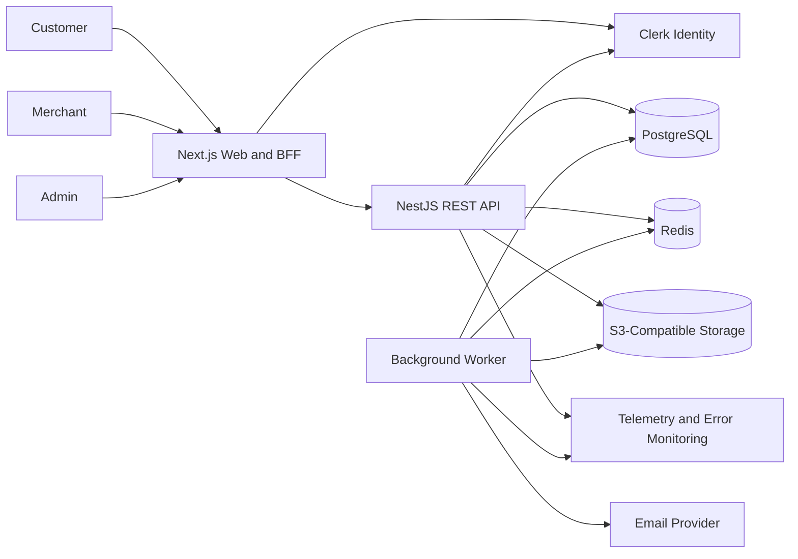

# System Architecture

## Architecture Style

Dealna starts as a modular monolith deployed as three processes:

1. Next.js web application.
2. NestJS API.
3. NestJS/BullMQ worker.

They share domain contracts and database tooling through the monorepo, but each process has a separate deployment artifact.

## Context Diagram



## Request Flow

### Public Browsing

1. Next.js renders the public page.
2. The web server requests public deal data from the API.
3. The API applies status, date, city, and category filters.
4. Cache headers or Next.js revalidation reduce repeated reads.

### Authenticated Mutation

1. The browser submits to the Next.js application.
2. The web layer verifies the Clerk session.
3. The web layer forwards the session token and request ID to the API.
4. The API verifies the token again.
5. NestJS guards enforce role and resource ownership.
6. The application service executes domain rules and persistence.

The web layer may perform optimistic navigation checks, but the API remains the security boundary.

### Voucher Claim

1. Customer requests a claim.
2. The API validates identity, role, deal state, dates, and inventory.
3. PostgreSQL creates the voucher and increments the claim count atomically.
4. The response returns the voucher code and a QR representation token.
5. A transactional outbox entry may trigger a confirmation email asynchronously.

### Voucher Redemption

1. Merchant scans a QR code or enters a manual code.
2. The API verifies merchant membership for the owning business.
3. PostgreSQL atomically changes the voucher from `ACTIVE` to `REDEEMED`.
4. The same transaction creates the redemption and audit records.
5. A repeated request returns an idempotent conflict result and never creates a second redemption.

## Domain Boundaries

| Module | Responsibility |
| --- | --- |
| Identity | Link Clerk identity to Dealna profile and role |
| Businesses | Business profiles, ownership, staff memberships |
| Categories | Category lifecycle and public taxonomy |
| Deals | Deal lifecycle, pricing, dates, inventory, publication |
| Vouchers | Eligibility, claims, codes, token hashes, expiry |
| Redemptions | Merchant validation and single-use redemption |
| Moderation | Business and deal review decisions |
| Analytics | Read models and aggregate metrics |
| Audit | Immutable records of sensitive actions |
| Files | Upload authorization and image metadata |
| Notifications | Email jobs and templates |

Modules may call each other through application services or domain interfaces. Controllers must not query another module's tables directly.

## Layering

Each backend module follows:

```text
controller
  -> application service
    -> domain policy
      -> repository interface
        -> Prisma repository
```

Cross-cutting infrastructure includes:

- Authentication guards.
- Authorization policies.
- Validation pipes.
- Request IDs.
- Logging and tracing.
- Exception mapping.
- Rate limiting.

## Scaling Path

Scale vertically and add API replicas before extracting services.

Potential future extraction candidates:

- Notifications worker.
- Search indexing.
- Analytics pipeline.
- Payment processing.

The voucher and redemption modules should remain together until there is a proven scaling or ownership reason to separate them.
